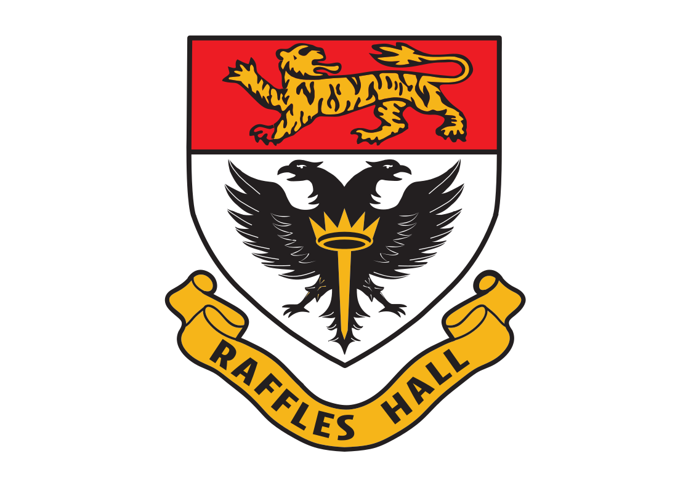
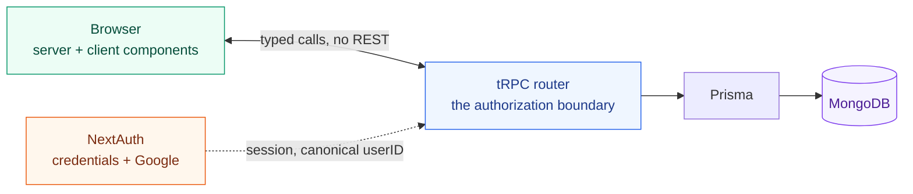

<div align="center">



# RHApp

**Hall life, in one place.**

*Bookings, CCAs, events, and the people who run them — for Raffles Hall, NUS.*

<sub>
  <a href="#quickstart">Quickstart</a> ·
  <a href="#the-map">The map</a> ·
  <a href="#under-the-hood">Under the hood</a> ·
  <a href="#working-on-it">Contributing</a> ·
  <a href="docs/The-New-RHApp.md">What's new</a>
</sub>

<br />


</div>

---

It started as a room-booking tool. It is now the place a resident goes to find a
practice room, apply to a CCA, book the interview, turn up to the event, and
check what they signed up for — and the place a CCA head, the JCRC, or the hall
office goes to run all of that without a spreadsheet.

---

## The map

Every route below is a surface someone actually uses. They are grouped by who
they belong to, because that is also how authorization is drawn: `/cca` is the
committee's dashboard, `/ccas` is the resident's view of the same CCAs, and the
two never share a procedure.

| | Route | What lives there |
|:--|:--|:--|
| **Everyone** | `/` | Home, and the door to everything else |
| | `/bookings` | Book a facility; see what you're holding |
| | `/events` | What's on in hall, and signing up for it |
| | `/ccas` | Browse CCAs, apply, book your interview |
| | `/ccas/applications` | Every application you have open, and its slot |
| | `/ccas/my` | The CCAs you're actually in |
| | `/profile` · `/onboarding` | Who you are, and the gate that insists on it |
| **CCA heads** | `/cca/[id]` | Roster, description, applications, interviews, events |
| **JCRC** | `/admin` | Users, roles, facilities, and the event review queue |
| **Hall office** | `/scrc` | Oversight without the keys to everything |

<details>
<summary><b>Five roles, and what separates them</b></summary>

<br />

`resident` is the baseline everyone holds. The other four are granted, and are
deliberately not a ladder — `scrc` is not "admin lite", it is a different job
with a different surface.

| Role | Is | Can |
|:--|:--|:--|
| `resident` | everyone signed in | book, browse, apply, attend |
| `cca_head` | scoped to a CCA | run that CCA, and only that CCA |
| `jcrc` | the hall committee | review events, manage users and facilities |
| `scrc` | the hall office | appoint the JCRC; oversight, not operations |
| `admin` | the keys | everything, sparingly |

`jcrc` and `scrc` are mutually exclusive in code — the office appoints the
committee, so it cannot quietly also *be* the committee.

</details>

---

## Under the hood

A [T3](https://create.t3.gg/) app, which mostly means one TypeScript type
travels from the database to the button without anyone re-typing it by hand.



**Three things worth knowing before you write a line of it:**

> **The procedure is the boundary.** Layouts check "signed in" and nothing more.
> Every real permission check lives in the tRPC procedure, so a route you forgot
> to guard cannot hand out data a procedure would have refused.

> **MongoDB is not Postgres wearing a hat.** `{ field: null }` in a Prisma
> `where` clause does **not** match documents where the field is *absent* — and
> on this schema, absent is the common case. Filter nullables in JS. The
> codebase says so, repeatedly, at every place it bit someone.

> **Identity is canonical.** Users arrive with an NUS alias *and* an E-number
> address. `canonicalUserID()` is the one funnel; a userID that skips it becomes
> a second person with an empty history.

---

## Quickstart

**You'll need** [Node 18.20.4](https://nodejs.org/) (`nvm use 18.20.4`),
npm or [bun](https://bun.sh/), and a
[MongoDB](https://www.mongodb.com/docs/manual/installation/) you can reach —
local, or an Atlas cluster.

```bash
git clone https://github.com/rhdevs/RH-app-2.0.git
cd RH-app-2.0
npm install

cp .env.example .env                 # then open it — see below
npx prisma db push                   # shape the database
npm run dev                          # → http://localhost:3000
```

**Before `npm run dev` will get you anywhere,** fill in two values in `.env`:

| | |
|:--|:--|
| `DATABASE_URL` | your MongoDB connection string |
| `NEXTAUTH_SECRET` | `openssl rand -base64 32` — never ship the placeholder |

Everything else in `.env.example` is optional and documented in place: Google
OAuth turns itself on only when both halves are set, and `RESEND_API_KEY` is
only needed if you're testing password-reset emails.

```bash
npx prisma studio     # browse the data
npm run lint          # eslint
npx tsc --noEmit      # typecheck — CI will, so you should
```

> [!WARNING]
> `prisma db push` silently drops indexes that aren't in `schema.prisma`.
> Check what exists before and after, especially against a shared database.

---

## Feature flags

Big surfaces ship dark and are switched on from the database, not a redeploy.
If a whole section of the app appears to be missing, check here first.

| Flag | Turns on |
|:--|:--|
| `cca.management.enabled` | the CCA head dashboard |
| `cca.applications.enabled` | applications and interview booking |
| `events.enabled` | the events pipeline, end to end |
| `scrc.enabled` | the hall-office surface |

---

## Working on it

```bash
git checkout -b yourname/what-it-does
```

Branch off `main`, keep the branch about one thing, and open a PR back to
`main`. Write the commit message for whoever has to understand the change in
six months — *why*, not *what*; the diff already says what.

Read [`docs/ContributionGuidelines.md`](docs/ContributionGuidelines.md) before
your first PR. New to git? [This guide](https://rogerdudler.github.io/git-guide/)
is the short version.

### Where the documentation is

| Document | Read it when |
|:--|:--|
| [`docs/SettingUp.md`](docs/SettingUp.md) | the quickstart above wasn't enough |
| [`docs/DeveloperGuide.md`](docs/DeveloperGuide.md) | you want the architecture in full |
| [`docs/ContributionGuidelines.md`](docs/ContributionGuidelines.md) | before opening a PR |
| [`docs/The-New-RHApp.md`](docs/The-New-RHApp.md) | you want the tour, in plain language |
| [`docs/plans/`](docs/plans/) | you're touching CCAs or roles and want the reasoning |

---

## Built by

<table>
<tr>
<td width="76" align="center" valign="middle">
  <a href="https://github.com/patrick-steve"></a>
</td>
<td valign="middle">
  <b>Patrick Steve Harrison</b><br />
  <sub><b>Maintainer and administrator</b> · <a href="https://github.com/patrick-steve">@patrick-steve</a></sub><br />
  <sub>Bookings · CCAs, applications and interviews · events · roles and permissions · the admin and hall-office surfaces · and the tRPC and identity layers they all sit on</sub>
</td>
</tr>
</table>

<sub>Which is to say: most of what is in this repository. Everything before it is in the <a href="https://github.com/rhdevs/RH-app-2.0/graphs/contributors">contributor graph</a>.</sub>

<div align="center">
<br />
<sub>Made for <b>Raffles Hall</b>, National University of Singapore · <a href="https://github.com/rhdevs">RHDevs</a></sub>
</div>
